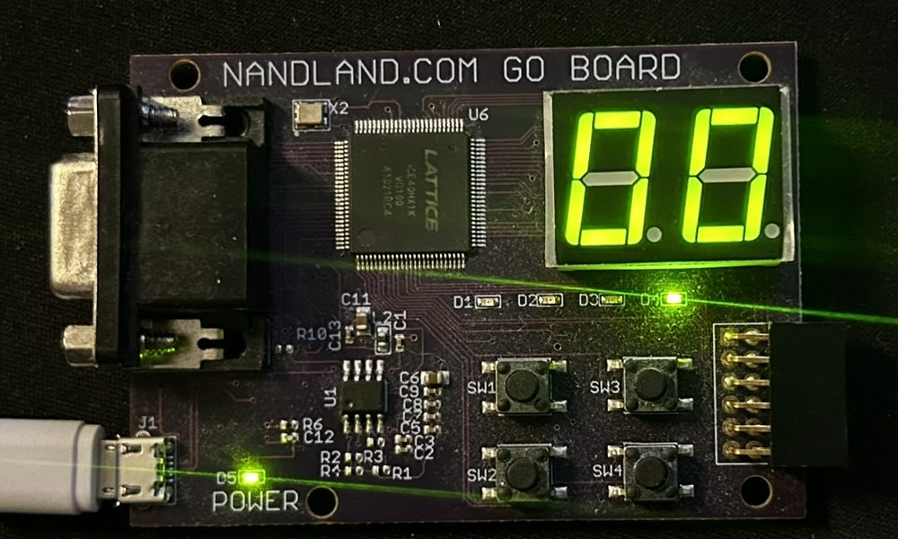
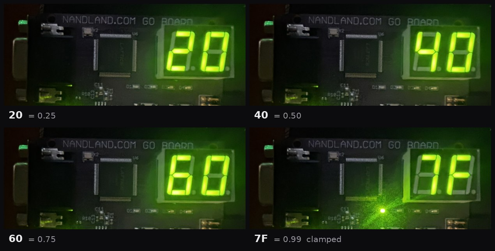

# Fixed-Point MAC Unit

A parameterised signed multiply-accumulate datapath in Verilog-2001, with a
self-checking testbench, synthesis results, and a working hardware demo.



The multiply-accumulate is the atomic operation of neural network inference:
a dense layer, a convolution and a matrix multiply are all dot products, and
a dot product is a sequence of MACs. Accelerators are, at the bottom, large
arrays of these.

```
acc <- acc + (a * b)      one MAC per clock while en is asserted
```

## Status

- [x] RTL complete, simulation passing (16/16, ~150k checks)
- [x] Verified at four parameter configurations
- [x] Synthesised and timing-closed on iCE40 HX1K (Go Board, iCEcube2)
- [x] Synthesised and timing-closed on Artix-7 (Vivado), with DSP48 inference measured
- [ ] Pipelined variant measured
- [x] Running on hardware (Nandland Go Board)

## Design

| Port | Dir | Width | Purpose |
|---|---|---|---|
| `clk` | in | 1 | |
| `rst_n` | in | 1 | asynchronous assert, active low |
| `clear` | in | 1 | zero the accumulator, start a new dot product |
| `en` | in | 1 | accumulate this cycle; hold when low |
| `a`, `b` | in | `WIDTH` | signed operands |
| `acc` | out | `ACC_WIDTH` | full-precision accumulator |
| `result` | out | `WIDTH` | rounded, shifted and saturated output |
| `overflow` | out | 1 | sticky; accumulator left signed range |
| `sat` | out | 1 | combinational; `result` is currently clamped |

Parameters: `WIDTH = 8`, `ACC_WIDTH = 32`, `FRAC_BITS = 7`.

### Bit growth

Signed 8×8 needs exactly 16 bits: the extreme products are `-128 × -128 =
+16384` and `-128 × +127 = -16256`, both inside signed 16-bit range.

The accumulator is 32 bits, giving 16 guard bits above the product. Worst-case
product magnitude is 2^14 and the accumulator holds 2^31, so:

```
2^31 / 2^14 = 2^17 = 131,072 accumulations before overflow is possible
```

A 1024-input dense layer uses 1024 MACs, so there is 128× headroom. The
testbench pushes past 131,072 to confirm the overflow flag actually fires.

### Q-format

Q-format is an interpretation, not a circuit. With Q1.7 inputs the product is
Q2.14 and the accumulator is Q18.14; producing a Q1.7 output means an
arithmetic shift right by `FRAC_BITS`. Changing `FRAC_BITS` costs zero gates
in the multiplier — it only moves the shift.

The output path rounds to nearest before shifting. Plain truncation of a
two's-complement value always rounds toward −∞, a −0.5 LSB DC bias that
accumulates across a layer; adding half an LSB first removes it. The result
saturates rather than wraps, because wrapping turns +1.2 into −0.8 — a sign
flip — while clamping only loses magnitude.

## Verification

`tb/tb_mac.v` is self-checking: it decides pass/fail and prints one verdict.
No waveform inspection required unless something breaks.

- **Golden model** — the accumulator recomputed in 64 bits, so the model
  itself can never overflow and is always trustworthy.
- **Scoreboard** — `acc`, `result`, `sat` and `overflow` compared every cycle.
- **Directed tests** — the signed corners (`-128 × -128` above all), `clear`
  mid-sequence, `clear` versus `en` priority, `en` low holding the
  accumulator, saturation in both directions, and accumulator overflow.
- **Randomised** — 10,000 MACs with random operands, half of them with random
  `en` and `clear` too.

Roughly 150,000 checks per run.

`tb/tb_param.v` is a second, simpler testbench that runs at *any* parameter
set. It exists because `tb_mac.v` is pinned to `WIDTH=8` and therefore cannot
catch a hardcoded shift amount or bit slice in the output path. The design is
verified at four configurations:

| WIDTH | ACC_WIDTH | FRAC_BITS | Result |
|---|---|---|---|
| 8 | 32 | 7 | pass |
| 4 | 16 | 3 | pass |
| 6 | 24 | 5 | pass |
| 12 | 40 | 9 | pass |

This caught a real defect: an earlier revision hardcoded the output-path
widths, which passed every test at 8 bits and failed at all three of the
other configurations.

The testbench was validated by mutation: deliberately breaking the RTL
(unsigned multiply, ignoring `en`, dropping saturation, truncating instead of
rounding, wrong `clear`/`en` priority) makes it fail, each bug caught by the
test aimed at it. A testbench that has never caught a bug has not been tested.

## Building

### Simulation

```sh
make -f sim/Makefile sim      # compile and run
make -f sim/Makefile sweep    # run tb_param.v at four parameter sets
make -f sim/Makefile wave     # run, then open GTKWave
make -f sim/Makefile lint     # syntax and width check the RTL alone
```

Windows, or without `make`:

```
run.bat
run.bat wave
run_param.bat
```

Or by hand:

```sh
iverilog -Wall -g2001 -o sim.vvp tb/tb_mac.v rtl/mac.v
vvp sim.vvp
```

### Synthesis — iCE40 HX1K (Go Board, iCEcube2)

1. New project, device iCE40 HX1K, package VQ100.
2. Set the synthesis engine to **Synplify Pro** (Project → Select Implementation Tool).
3. Add `rtl/mac.v` to Synthesis, and `synth/mac.sdc` as the timing constraint.
4. Add `Go_Board_Constraints.pcf` under Place & Route for pin assignments.
   `.sdc` is timing, `.pcf` is pins — two different files.
5. Run synthesis and place-and-route; read Fmax off the timing report.
6. Program with Diamond Programmer Standalone; the bitstream lands in
   `sbt/outputs/bitmap/`.

The HX1K has no DSP blocks, so the multiplier is built entirely from LUT4s
and carry chains. That is the interesting part, not a limitation.

### Synthesis — Artix-7 (Vivado)

No board required. Create a project targeting `xc7a35ticsg324-1L`, add
`rtl/mac.v` and `synth/mac_a7.xdc`, set the top module to `mac`, and run
synthesis and implementation.

Do not expect a DSP48. This design maps entirely to LUTs and carry chains on
Artix-7 as well, for reasons measured and explained below. If you want to
reproduce that experiment, `synth/dsp_experiment/` holds two cut-down variants
and a matching constraint file.

One Vivado trap worth knowing: `MAX_DSP` is a persistent property on the
synthesis run, not a per-invocation flag. Setting it to 0 once silently
applies to every later run in that project. Check it before trusting a
utilisation report:

```tcl
get_property STEPS.SYNTH_DESIGN.ARGS.MAX_DSP [get_runs synth_1]
```

## Results

### iCE40 HX1K, VQ100 — iCEcube2 2020.12, Synplify Pro, post-route

| Metric | Value |
|---|---|
| **Fmax** | **132.64 MHz** |
| Target (Go Board oscillator) | 25 MHz |
| Slack at 25 MHz | +32.46 ns |
| Logic cells | 227 / 1280 (17.7%) |
| &nbsp;&nbsp;combinational | 194 |
| &nbsp;&nbsp;sequential | 33 |
| LUT4s | 224 |
| Carry cells | 69 |
| Registers | 33 (32 accumulator + 1 sticky overflow) |
| Logic tiles (PLBs) | 46 / 160 (28.8%) |
| Block RAM | 0 / 16 |
| DSP blocks | none — the HX1K has no hard multipliers |
| I/O | 62 / 72 |

The multiplier is built entirely from LUT4s and carry chains, since this part
has no DSP blocks. At 25 MHz the design has 5.3x frequency headroom, so the
pipelined variant is not needed for this board — it remains an experiment
rather than a fix.

Synthesis-time estimate was 85.3 MHz and post-placement was 122.35 MHz, both
conservative against the 132.64 MHz post-route result. Quote the post-route
number; the earlier two are estimates against modelled routing.

### Critical path

```
acc_q[0]  ->  31-stage carry chain (the multiply-accumulate)
          ->  un1_product_2_cry_30_c_RNIDP2L2H   (SB_LUT4)
          ->  ovf_q_RNO_0                        (SB_LUT4)
          ->  ovf_q / D
```

| | ps |
|---|---|
| Clock-to-Q | 540 |
| Data path | 6628 |
| Setup | 372 |
| **Register-to-register total** | **7540** |

The path ends at the **overflow flag**, not at the accumulator. `acc_ovf`
compares the sign bits of `acc_q`, `product` and `sum`, so it cannot begin
evaluating until the entire carry chain has resolved, and then needs two more
LUT levels on top. `acc_q[31]` finishes with 1.8 ns more slack than `ovf_q`
does.

Three gates that look free in the source turn out to set Fmax, because they
sit downstream of everything else. A sticky flag does not need to be correct
in the same cycle it is raised, so registering `acc_ovf` and OR-ing it in one
cycle later would take this logic off the critical path entirely, at the cost
of the flag lagging by one cycle.

### Artix-7 XC7A35T-1L (csg324) — Vivado 2026.1, post-route

Same RTL, same `create_clock -period 5.000` constraint, same false-path
treatment of the I/O. `synth/mac_a7.xdc`.

| Configuration | LUTs | FFs | DSP48E1 | CARRY4 | WNS @ 5 ns | Fmax |
|---|---|---|---|---|---|---|
| `mac` — the design as shipped | 146 | 33 | **0** | 35 | 1.540 ns | **289.0 MHz** |
| `mac_core` — datapath only, LUT | 97 | 32 | 0 | 24 | 2.187 ns | 355.5 MHz |
| `mac_core` — datapath only, DSP | 1 | 0 | **1** | 0 | see below | <= 464.3 MHz |

At 289 MHz the Artix-7 is 2.2x the iCE40's 132.64 MHz — a fair reflection of a
28 nm part against a 40 nm one, measured the same way on the same source.

**The design does not map to a DSP48E1, and `(* use_dsp = "yes" *)` does not
change that.** A DSP48E1 is a 25x18 multiplier with a 48-bit accumulator, so an
8x8 MAC would seem an easy fit. Two things in `mac.v` prevent it:

1. **The asynchronous reset.** `always @(posedge clk or negedge rst_n)` — no
   register inside a DSP48E1 has an async reset path, so `acc_q` can never be
   absorbed into one whatever the attribute says.
2. **The overflow detector.** `acc_ovf` reads `sum`, the adder output *before*
   the register. Inside a DSP that node does not exist in the fabric, so
   Vivado would have to rebuild the whole 32-bit adder in LUTs anyway — at
   which point the block buys nothing.

`synth/dsp_experiment/mac_core.v` removes both (synchronous reset, no overflow
/ rounding / saturation) and carries the attribute. It maps as textbook
DSP48E1 accumulate mode: `a` to `A[29:0]`, `b` to `B[17:0]`, `acc_q` to the
internal **P register**, `en` to `CEP`, and `!rst_n || clear` to `RSTP` — which
is the single surviving LUT2. 97 LUTs, 32 flip-flops and 24 carry chains
collapse into one hard block.

That row's Fmax is a ceiling, not a measurement. With the accumulator inside
the DSP there are no register-to-register paths left in the fabric, so
`report_timing_summary` returns `inf` and reports setup as `NA`. The only
remaining constraint is the block's own pulse-width check — `DSP48E1/CLK`
minimum period 2.154 ns, hence 464.3 MHz. Registering `a` and `b` would put
real paths back under the timer, at the cost of a cycle of latency.

`synth/dsp_experiment/mac_dsp.v` isolates the reset variable alone (the full
design, synchronous reset, attribute applied) for anyone who wants to separate
the two causes rather than take them together.

**What the numbers actually say.** The bare multiply-accumulate is 97 LUTs;
the shipped design is 146. Overflow detection, round-to-nearest and saturation
cost **49 LUTs (+51%) and 66 MHz** — and they are what makes the unit
unmappable to the hard block. On a part with DSP48s the arithmetic is very
nearly free, and essentially all of the logic that remains is the correctness
guarantees wrapped around it. The interesting engineering question is not
"LUT or DSP" but which of those guarantees you are willing to pay for.

The critical path is the same endpoint Synplify found on the iCE40:
`acc_q[2]` -> eight CARRY4s -> LUT5 -> **`ovf_q`**. Two vendors, two
architectures, two independent tools, one bottleneck — the sticky overflow
flag that the source comments predicted.

### Note on I/O

Exposing the full 32-bit `acc` as a top-level port consumes 62 of the 72
available pins and saturates three of the four I/O banks. That is fine for a
synthesis measurement, but a board-level wrapper driving the LEDs and
seven-segment display must keep `acc` internal.

## Hardware demo

`rtl/mac_top.v` wraps the MAC for the Nandland Go Board: an eight-entry ROM of
Q1.7 operand pairs, one multiply-accumulate per button press, the result on the
dual seven-segment display in hex, and status on the LEDs.

| Control | Function |
|---|---|
| Switch 1 | step one MAC from the operand ROM |
| Switch 2 | clear the accumulator, rewind the ROM |
| Switch 3 | reset |
| Switch 4 | hold to show `acc[7:0]` instead of `result` |
| LED 1 | `sat` -- the result is being clamped |
| LED 2 | `overflow` -- sticky accumulator overflow |
| LED 3 | the ROM sequence has wrapped |
| LED 4 | heartbeat -- the bitstream is loaded and the clock is running |

The first four ROM entries are all `0.5 x 0.5`, so the running total should
climb 0.25, 0.50, 0.75, 1.00. Q1.7 cannot represent 1.00 -- it tops out at
0.992 -- so the fourth press clamps and raises `sat`:



The saturation LED is dark in the first three frames and lit in the fourth.

Continuing past the eighth press replays the same operands against the
surviving accumulator rather than from zero: the ROM pointer wraps, the
accumulator does not. LED 3 signals this. Pressing Switch 2 clears both and the
sequence repeats identically.

Full press-by-press behaviour, measured on the board:

| press | a | b | product | acc | result | 7-seg | sat |
|---|---|---|---|---|---|---|---|
| 1 | 64 | 64 | 4096 | 4096 | 32 | `20` | |
| 2 | 64 | 64 | 4096 | 8192 | 64 | `40` | |
| 3 | 64 | 64 | 4096 | 12288 | 96 | `60` | |
| 4 | 64 | 64 | 4096 | 16384 | 127 | `7F` | yes |
| 5 | -64 | 127 | -8128 | 8256 | 65 | `41` | |
| 6 | -128 | 127 | -16256 | -8000 | -62 | `C2` | |
| 7 | -128 | 127 | -16256 | -24256 | -128 | `80` | yes |
| 8 | 0 | 0 | 0 | -24256 | -128 | `80` | yes |

Every value matches `tb_mac_top.v` press for press.

### Building the demo

A separate iCEcube2 project from the standalone synthesis run, so the timing
numbers above stay reproducible:

1. iCE40HX1K, VQ100, Synplify Pro; top-level unit `mac_top`
2. Design Files: `mac_top.v`, `mac.v`, `debounce.v`, `hex7seg.v`
3. Constraint Files: `synth/mac_top.sdc`
4. Place & Route: `synth/Go_Board_Constraints.pcf`
5. Program with Diamond Programmer Standalone

Simulate first with `run_top.bat` (or `iverilog -g2001 -o t.vvp tb/tb_mac_top.v
rtl/mac_top.v rtl/mac.v rtl/debounce.v rtl/hex7seg.v && vvp t.vvp`), which
checks the displayed byte, the segment patterns and the status LEDs across the
whole ROM.

The accumulator is deliberately not brought out to pins here. Exposing all 32
bits costs 62 of the 72 available I/O and fills three I/O banks, leaving nothing
for the display.

## Next

A 4×4 systolic array — sixteen of these in a grid, operands flowing
left-to-right and weights top-to-bottom, which is how a matrix engine
actually works. `mac.v` is parameterised and drops in unchanged.

## Layout

```
rtl/mac.v          the design
tb/tb_mac.v        self-checking testbench (WIDTH=8)
tb/tb_param.v      parameter-sweep testbench (any WIDTH)
sim/Makefile       simulation driver
synth/mac.sdc      timing constraints
run.bat            Windows simulation script
run_param.bat      Windows parameter sweep
docs/img/          board photographs
```
